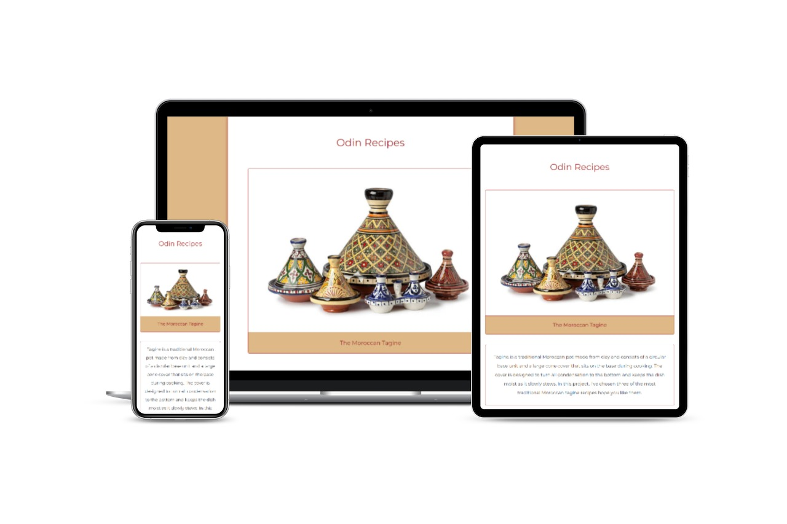

# Odin Recipes

This is my project as a basic recipe website in the Foundations course from [The Odin Project](https://www.theodinproject.com/lessons/foundations-recipes).

## View Demo

Check it out on GitHub Pages: [Here](https://redwanhaitami.github.io/odin-recipes/)

## Description

- Built with HTML and CSS skills.
- It consists of a main index page linked with three recipes pages.
- Responsive for both Desktop and Mobile.

## What was learned

In this project I tried to use all the HTML and CSS knowledge that I have acquired in the foundations course:

- How to build a simple website and using Git.
- How to add HTML boilerplate and elements to the index files.
- Finally, link with CSS file and style with various CSS properties.

## Attributes

- Images by istockphoto
- Favicon by flaticon

